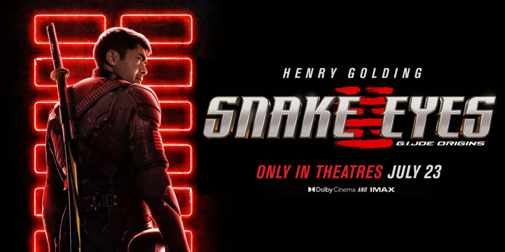

Here's a beautifully formatted **README.md** with placeholder image suggestions that you can customize:


```markdown
# 🎬 SG Films - Netflix-Inspired Streaming Platform

  
*A cinematic streaming experience built with React*

## ✨ Features

<div align="center">
  
  
  
</div>

| Feature | Description |
|---------|-------------|
| 🎥 **Dynamic Hero Banner** | Eye-catching featured content with interactive buttons |
| 📺 **Content Categories** | Organized movie rows (Popular, Blockbusters, Upcoming) |
| 🌐 **Responsive Design** | Perfectly adapted for all devices |
| 🔍 **Interactive UI** | Hover effects and smooth scrolling |
| 📱 **Social Integration** | Connected with YouTube, Twitter, Facebook, Instagram |

## 🛠️ Technologies

<div align="center">
  
  
  
</div>

## 🚀 Quick Start

1. **Clone the repository**
   ```bash
   git clone https://github.com/your-username/sg-films.git
   ```

2. **Install dependencies**
   ```bash
   cd sg-films
   npm install
   ```

3. **Run the development server**
   ```bash
   npm start
   ```

4. **Open in browser**
   ```
   http://localhost:3000
   ```

## 🖼️ Project Screenshots

<div align="center">
  
  | Home Page | Movie Selection | Mobile View |
  |-----------|-----------------|-------------|
  |  |  |  |

</div>

## 🌟 Why This Project?

- **Perfect Netflix Clone**: Mimics core streaming platform features
- **Modern UI**: Clean, intuitive interface with smooth animations
- **Developer Friendly**: Well-structured React components
- **Customizable**: Easy to modify for different content types

## 📂 Project Structure

```
sg-films/
├── public/
├── src/
│   ├── assets/            # All images
│   │   ├── background.webp
│   │   ├── search.jpg
│   │   └── ...
│   ├── components/        # React components
│   │   └── Navbar.js
│   └── styles/           # CSS files
│       └── Navbar.css
├── package.json
└── README.md
```

## 🤝 How to Contribute

[](http://makeapullrequest.com)

1. Fork the project
2. Create your feature branch (`git checkout -b feature/AmazingFeature`)
3. Commit your changes (`git commit -m 'Add some AmazingFeature'`)
4. Push to the branch (`git push origin feature/AmazingFeature`)
5. Open a Pull Request

## 📜 License

MIT © [Your Name]

---

<div align="center">
  Made with ❤️ and React
</div>
```

### To use with your actual images:
1. Replace placeholder URLs (`https://placehold.co/...`) with your actual screenshots
2. Upload screenshots to your repository or image hosting service
3. Update the banner image path to point to your `background.webp`
4. Customize the "Why This Project?" section with your specific goals

### Pro Tip:
For real screenshots:
1. Take screenshots of your running application
2. Save them in an `/screenshots` folder
3. Update the markdown image paths accordingly

Would you like me to suggest any additional sections or make any adjustments to this README?
